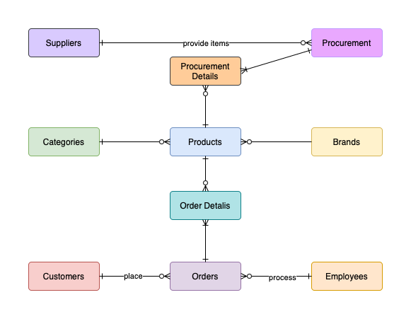
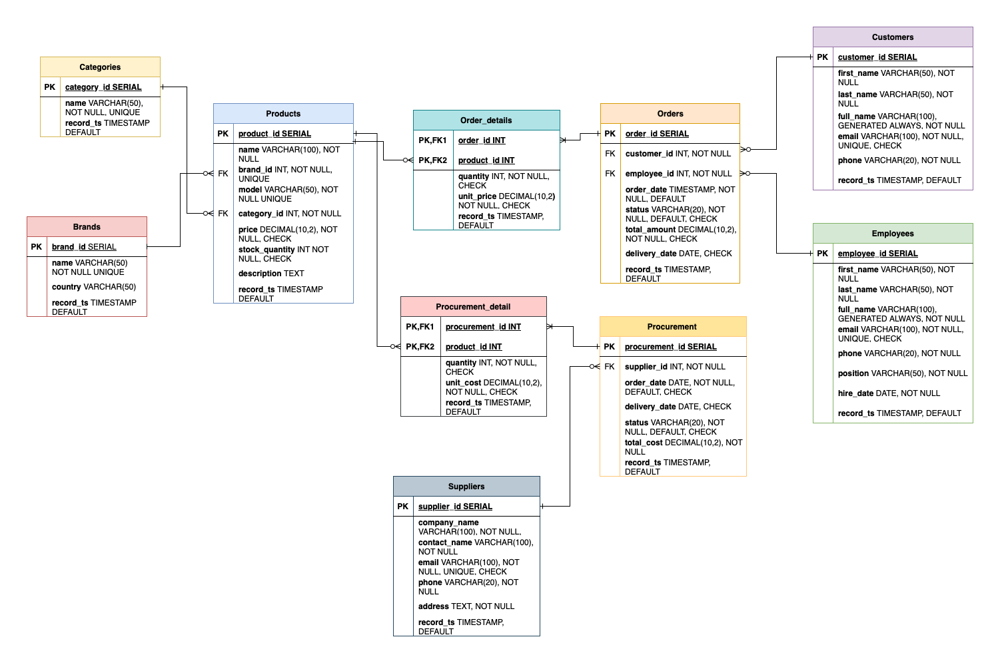

# Household Appliances Store Database Project

A comprehensive database management system for a household appliances retail store, featuring complete conceptual, logical, and physical database models with PostgreSQL implementation.

## 📋 Table of Contents
- [Overview](#overview)
- [Database Models](#database-models)
- [Database Schema](#database-schema)
- [Features](#features)
- [Installation](#installation)
- [Database Functions](#database-functions)
- [Analytics](#analytics)
- [Security](#security)
- [Technologies Used](#technologies-used)

## 🎯 Overview

This project demonstrates a complete database design lifecycle for a household appliances store, including:
- **Conceptual Model**: High-level business requirements and entity relationships
- **Logical Model**: Detailed entity-relationship diagram with attributes and constraints
- **Physical Model**: PostgreSQL implementation with optimized tables, functions, and security

The system manages products, customers, orders, employees, suppliers, and procurement processes for a retail appliances business.

## 🗂️ Database Models

### Conceptual Model



The conceptual model shows the high-level business entities and their relationships:
- **Customers** place **Orders** processed by **Employees**
- **Orders** contain **Products** from various **Categories** and **Brands**
- **Suppliers** provide products through **Procurement** processes

### Logical Model



The logical model details all entities with their attributes, primary keys, foreign keys, and constraints.

## 🏗️ Database Schema

### Core Tables

| Table | Purpose | Key Relationships |
|-------|---------|-------------------|
| `categories` | Product categorization | Referenced by products |
| `brands` | Product manufacturers | Referenced by products |
| `products` | Store inventory | Links to categories and brands |
| `customers` | Customer information | Referenced by orders |
| `employees` | Staff management | Referenced by orders |
| `orders` | Transaction records | Links customers and employees |
| `order_details` | Order line items | Links orders and products |
| `suppliers` | Vendor information | Referenced by procurement |
| `procurement` | Purchase orders | Links to suppliers |
| `procurement_details` | Purchase line items | Links procurement and products |

### Key Features
- ✅ Referential integrity with foreign key constraints
- ✅ Data validation with check constraints
- ✅ Automatic timestamp tracking
- ✅ Generated computed columns (full names)
- ✅ Unique constraints for business rules

## 🚀 Features

### Data Management
- Complete CRUD operations for all entities
- Automated order processing and inventory tracking
- Supplier and procurement management
- Customer and employee record keeping

### Business Logic
- Price and quantity validation
- Order status workflow (pending → shipped → delivered)
- Procurement status tracking (ordered → received)
- Email format validation

### Analytics
- Quarterly sales analytics
- Customer purchase history
- Product performance metrics
- Supplier relationship tracking

## 📦 Installation

1. **Prerequisites**
   - PostgreSQL 12+ installed
   - Database client (pgAdmin, DBeaver, or psql)

2. **Database Setup**
   ```sql
   -- Run the complete script
   \i HouseholdAppliancesStore_Scripts.sql
   ```

3. **Verify Installation**
   ```sql
   -- Check database and schema creation
   \l appliances_store
   \dn store_data

   -- Verify table creation
   \dt store_data.*
   ```

## ⚙️ Database Functions

### 1. Update Supplier Function
Updates supplier information dynamically based on column name:
```sql
store_data.update_supplier(supplier_id, column_name, new_value)
```

### 2. Add Order Function
Creates new orders with validation:
```sql
store_data.add_order(customer_email, employee_email, total_amount, order_date, status)
```

## 📊 Analytics

### Quarterly Analytics View
```sql
SELECT * FROM store_data.recent_quarter_analytics;
```

This view provides:
- Customer purchase summaries
- Product performance metrics
- Sales totals by customer and product
- Quarterly trend analysis

## 🔒 Security

### Role-Based Access Control
- **Manager Role**: Read-only access to all tables
- **Default Read-Only Mode**: Prevents accidental data modifications
- **Schema-Level Security**: Restricted public access

### Data Validation
- Email format validation
- Price and quantity constraints
- Date range validations
- Status value restrictions

## 🛠️ Technologies Used

- **Database**: PostgreSQL 12+
- **Language**: SQL/PL-pgSQL
- **Features Used**:
  - User-defined functions
  - Views
  - Constraints
  - Role-based security
  - Generated columns

## 👤 Author

**Uliana Krekhovetska**
- GitHub: [@uliana-krekhovetska](https://github.com/uliana-krekhovetska)

---

*This project demonstrates database design principles and PostgreSQL implementation techniques for a real-world retail business scenario.*